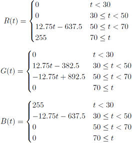

# Audio - CPU - RGB
This (private created (Windows-Program (Visual-Studio C# Project) deals with decoding/analyzing Audio-Output or CPU-Temperature, calculate RGB-Values from them and sending them via Serial to any device (in my case a PIC-Microcontroller see: [PIC16F1825 PWM USART LED](https://bitbucket.org/arnegue/pic16f1825-pwm-usart-led))

`
Attention: A very big part of this code is copied from: ` [www.codeproject.com]
`I only extended this code by my needs and do not claim that it's mine. I just wanted to contribute my code to other with similar ideas!`

# Starting the Application
As I mentioned this is a Windows-Application and as far as I know the Bass-library supports Vista but not below.
The binary is located in ``\Audio_CPU_RGB\bin\Release\`` and is called ``Audio-CPU-RGB.exe``

## CPU-Temperature to RGB
It is rather hard to get the CPU-Temperature from default Windows libraries. I tried one which only worked on my Laptop but not on my desktop PC. So i downloaded OpenHardwareMonitorLib and now it seems to work.

How do you divide a temperature by 3 color values?
Well, i thought, blue is cold, green is medium and red is hot. Simply as that i said blue is 30 °C, green is 50 °C and red is 70 °C.

So i wrote down a small Diagram

The mathematical equations for these are: 

## Audio to RGB
As I told the main part of getting the audio was not my work, but I continued it. But how do you convert a 16-row-spectrum to RGB-colors? Well fortunately this value-range is also from 0 to 255 like the colors. So I divided 16 rows to 3 parts for red, green and blue, calculated the average of each color.

## Used software
- Visual Studio 2015

## Used libraries
- OpenHardwareMonitorLib: [ohm]
- bass.dll, Bass.Net.dll, basswasapi.dll: [bass]

## Compiling
Attention: When compiling to a new Solution Configuration ("Debug", "Relase", etc.) be aware that you copy the 4 dlls ("bass.dll", "Bass.Net.dll", "basswasapi.dll" and "OpenHardwareMonitorLib.dll" into the folders ``\Audio_CPU_RGB\bin\<SolutionName>`` and ``\Audio_CPU_RGB\obj\<SolutionName>)``!

   [www.codeproject.com]: <http://www.codeproject.com/Articles/797537/Making-an-Audio-Spectrum-analyzer-with-Bass-dll-Cs>
   [dill]: <https://github.com/joemccann/dillinger>
   [ohm]: <openhardwaremonitor.org>
   [bass]: <http://www.un4seen.com/>
   
#  Example
An example for how both programs interact can be found on [Youtube](https://youtu.be/dFWHwqLQKIw)